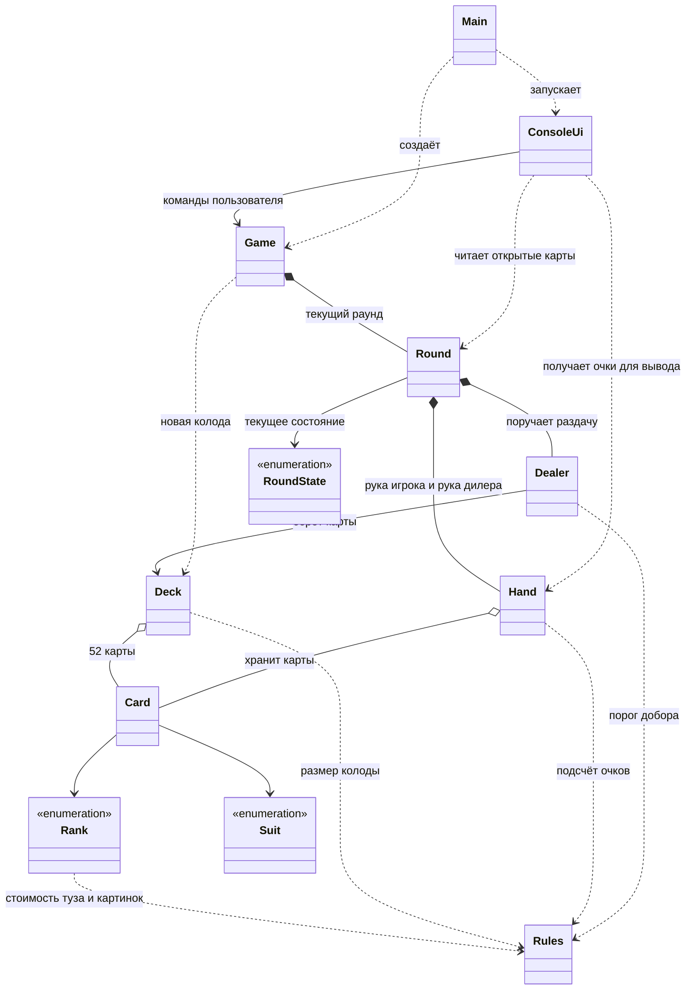
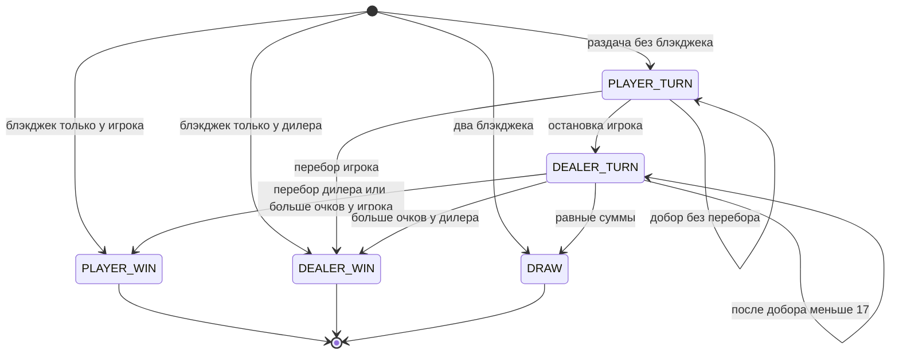

# Архитектура Blackjack

9 классов, 3 перечисления. Схема описывает текущую реализацию;
одобрение преподавателя не предполагается автоматически.

## Почему обязанности распределены так

`Card` хранит неизменяемые достоинство и масть. Две карты равны по этим полям;
`equals` и `hashCode` согласованы. Стоимость туза не записывается в саму карту:
она зависит от остальных карт и вычисляется в `Hand`.

`Hand` владеет своим списком и возвращает неизменяемые снимки. Она сначала
считает тузы по 11, затем понижает их по одному до 1, пока сумма больше 21.
Например, туз + туз + девятка дают 21, туз + тройка + десятка дают 14.

`Dealer` извлекает и раздаёт карты. `Round` решает, когда разрешён ход,
поручает раздачу дилеру и определяет исход. Участники представлены двумя
руками; пустые `Player`/`Participant` и наследование без поведения не нужны.

`Game` создаёт раунды и записывает каждый результат ровно один раз.
Методы изменения `Round` доступны внутри пакета; публичные команды идут
через `Game`. Снаружи у раунда доступны только состояние и снимки открытых карт.

`ConsoleUi` занимается вводом и выводом. Она обращается к `Game` для действий
и к `Hand` для отображаемых очков, поэтому не содержит второй реализации
правил подсчёта. Игровая модель не использует `Scanner` и `System.out`.

`Main` связывает объекты. `Rules` хранит числа правил, а три enum ограничивают
допустимые достоинства, масти и состояния. Числа 2–9 в описании `Rank` —
значения самих достоинств; 21, 17, стоимость туза и картинок именованы в `Rules`.

## Состояния раунда

Во время `PLAYER_TURN` вторая карта дилера не возвращается из `Round`,
и консоль не показывает полную сумму его руки. После завершения раунда
или перехода хода к дилеру открываются все карты.

## Воспроизводимые проверки

Обычный `Deck(Random)` создаёт 52 карты и перемешивает их. Пакетный конструктор
`Deck(List<Card>)` нужен для сценариев с известным порядком. Пакетный конструктор
`Game(Supplier<Deck>)` позволяет подавать новую такую колоду для каждого раунда.
Это стандартный функциональный интерфейс Java; собственных дополнительных
интерфейсов или классов-заглушек в основном коде нет.
